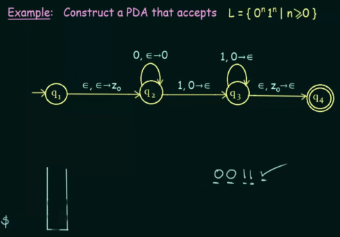

**Main Source:**

- **Book chapter 3.1, 3.2**
- **Neso Academy playlist 85-89**
- **Neso Academy playlist 91-93**

### PDA

A [finite automaton](/cs-notes/theory-of-computation-and-automata/finite-automata) has a very limited memory to keep track its computation. If we were to design an automaton that determine the length of string, a finite automaton wouldn't work. **Pushdown Automata (PDA)** is the extension of finite automaton that has more memory, specifically a [stack memory with the LIFO principle](/cs-notes/data-structures-and-algorithms/stack). A PDA recognizes context-free languages governed by [context-free grammar](/cs-notes/theory-of-computation-and-automata/context-free-grammar). Similar to finite automaton, it can either accept or reject the language.

Component of PDA:

- **Input file/tape**: Contains the input symbols that the PDA reads from left to right.
- **Finite state control**: The control unit of the PDA that determines its state.
- **Pushdown store**: It's the stack that is used to store symbols from the input tape. It has infinite size, and it allows for two stack operations: push (adding a symbol to the stack) and pop (removing the top symbol from the stack).

  
Source: Book page 160

#### Formal Definition

Formally, a PDA is defined as 7 tuples: $P = (Q, \Sigma, \Gamma, \delta, q_0, z_0, F)$

- $Q$ is the finite set of states.
- $\Sigma$ is the finite set of input alphabet/symbols.
- $\Gamma$ (uppercase gamma) is the finite stack alphabet.
- $\delta: Q \times (\Sigma \cup {\epsilon}) \times \Gamma \rightarrow Q \times \Gamma*$ is the transition function, where $Q \times \Gamma^*$ represent a power set. The power set contains all the possible combination of the pair of states and stack contents.
- $q_0$ is the initial or start state.
- $Z$ is the initial or start stack symbol.
- $F$ is the set of accepting or final states.

The thing worth to note is the transition function, it takes the current state $Q$, input symbols $\Sigma$, including the empty string $\epsilon$, and the current topmost symbol of the stack $\Gamma$. When transitioning, the topmost symbol may or not be popped, a new state will be produced, and a new symbol may be pushed onto the stack.

For example, $\delta(q_1, a, X)$ could yield a set of pairs $\{(q_2, XY), (q_3, YZ), (q_4, \epsilon)\}$, indicating that from state $q_1$ reading input symbol "a" while having "X" on topmost of the stack, the PDA could:

- Transition to state $q_2$ with "XY" on the stack, meaning it pushes "Y" onto the stack.
- Transition to state $q_3$ with "YZ" on the stack, meaning it pop "X", then pushes "YZ".
- Transition to state $q_4$ with $\epsilon$ on the stack, meaning it will pop "X" from the stack, leaving the stack to be empty.

We see that the primary difference between finite automaton and PDA is, a PDA takes extra argument (the stack symbol) and produce an output (modifying the stack).

In the case when the topmost stack is $\epsilon$ or empty, then the stack is simply not being read or popped.

#### Example

  
Source: https://youtu.be/eY7fwj5jvC4?si=eRqTnkjH7ODIc1kN&t=627

The PDA should accept language with equal length of "0"'s and "1"'s.

In the video, the notation $\epsilon, \epsilon \rightarrow z_0$ denotes that the transition takes input $\epsilon$, pop symbol on the left-hand side, and push the symbol on right-hand side. A symbol $\epsilon$ means the transition does nothing to the stack. An $\epsilon$ on the left-hand side means the transition doesn't pop, while on right-hand side, it doesn't push.

In state $q_2$, upon receiving input "0", it checks if the topmost symbol is $\epsilon$. Because it is just $\epsilon$, then it does nothing. Then, on the right-hand side, there is a symbol "0", signifying that it should be pushed onto the stack. If the input is "1", it checks if "0" is the topmost symbol; if it is, then it should be popped. After that, on the right-hand side, this $\epsilon$ denotes that nothing is pushed onto the stack.

The concept behind this PDA is that, in state $q_2$, we push as many "0"s as the input remains "0". Then, upon encountering "1" in the input, transition to state $q_3$ and start popping all the "0"s every time "1" is inputted. Upon reaching the final state $q_4$, the PDA checks if the stack is empty. If it is, we can conclude that the number of "0"s matches the number of "1"s. If not, it indicates that either too many "0"s or "1"s were pushed (due to inputting them in the input string), preventing them from being popped altogether, thus leaving the stack not empty.

:::tip
Sometimes, the symbol $z_0$ is pushed at the beginning of the PDA and popped at the end of PDA. This symbol is used to indicate the last element on the stack.
:::

#### PDA Even Palindrome

  
Source: https://youtu.be/TEQcJybMMFU?si=NcawjrirsnjL8ybx&t=803

This PDA should accept even-length palindrome, meaning the string length should be even, and it is palindrome, or can be read the same from the front or backward (e.g., try reversing the string "abba", we will obtain the same thing, but not with "abab").

The idea of this PDA is, in $q_2$, we push any symbol that appears on the input. After an empty input $\epsilon$ is encountered in the middle, it means that we can transition to state $q_3$ and start popping the stack to check if the input is palindrome. In the $q_3$, anything we read as input will be popped from the stack. If the topmost symbol on the stack is not equal to the input, then the PDA will not transition to anywhere from the state $q_3$, indicating the string is not accepted.

As always, when the input is $\epsilon$ again, we transition to state $q_4$ and check if the stack is empty (denoted by $z_0$ on top of the stack). If it is, then the string is accepted, as we have reached the final state.

For example, with the input "abab", we will have $z_0$, $a$, and $b$, respectively from the bottom of the stack.

However, the problem with this analysis is, how can we assume that an input is $\epsilon$ or empty? Typically, input is $\epsilon$ when we have reached at the end of the input, but in the PDA, we keep expecting for input even after the $\epsilon$ transition from the $q_2$ to $q_3$.

  
Source: https://youtu.be/BxA-aI2dyRo?si=mmMY52_ormtTd3bB&t=152

We can make assumption that $\epsilon$ symbol appears before and after every input. After that, we can list all possible transition when input has or not $\epsilon$ symbol. We will also include the current state and stack content for each of the path. If at least a single path exist in the list that leads from the start state to the final state, we can say that the PDA accepts the string.

This is similar to [NFA](/cs-notes/theory-of-computation-and-automata/finite-automata#nfa), in which it is possible to transition to every path with any input and theoretically, each transition is done in parallel.

  
Source: https://youtu.be/BxA-aI2dyRo?si=K0ysvgZgszM3dMsH&t=555 (combined images)

### CFG to PDA

As said before, PDA can recognize all context-free languages. Given a context-free grammar, the grammar that governs context-free language, we can construct an equivalent PDA that recognizes the same language.

One way to convert from a CFG to PDA is, we can transform the CFG into a [GNF](/cs-notes/theory-of-computation-and-automata/context-free-grammar#greibach-normal-form) first. This will simplify certain aspects of the conversion process, such as handling left-recursive productions.

The PDA simulates the derivation process of the CFG by using its stack from the start symbol to keep track of non-terminals and terminals. In the conversion of CFG in GNF to PDA, the stack will only contain non-terminals, because of the properties of GNF (non-terminals are always on the end of the right-hand side of the production rule).

  
Source: Book page 168

For example, given a grammar $G = (\{S, A, B\}, \{a, b\}, S, P)$ and $P = \{S \rightarrow a, S \rightarrow aAB, A \rightarrow aA, A \rightarrow a, B \rightarrow bB, B \rightarrow b\}$.

$S \rightarrow aAB$ means that we transform the start symbol into a terminal and two non-terminals. Converting this to PDA, the start symbol can be thought as the start of the stack. The non-terminals, which eventually will produce some terminals, act as the stack symbols. Lastly, the terminal, which is the building block of actual language, act as the input for the PDA. Therefore, the conversion to PDA from this particular derivation will result in a transition $\delta(q_1, a, S) \rightarrow \{q_1, AB\}$.

  
Source: Book page 168, 169

### PDA to CFG

Component of PDA to CFG:

- **States**: The states of PDA act as the non-terminals in CFG. This is because a state represent different stages of computation, which in turns is associated with specific derivation process.
- **Input**: As explained before, the input act as the terminals of CFG, because it is what define a language itself.
- **Stack**: Additional state or condition of the current derivation process.
- **Transitions**: The transitions of the PDA are converted into production rules in the CFG.

  
Source: https://youtu.be/kyvLetfjOhc?si=oE4zxzBRi3VFe5WE&t=230

The video denotes notation like $A_{pq}$, this represents a non-terminal that is produced from transitioning from state $p$ to $q$. There will be non-terminal for every pair of states.

#### Simplifying

Before converting it, we should simplify the PDA first. The steps to simplify the PDA:

1. PDA should be simplified (i.e., only have one final state). One way to simplify it is that, we unite all the final state into one common final state, where the input as well as the stack for transition is $\epsilon$.

     
    Source: https://youtu.be/kyvLetfjOhc?si=F6qVhF3AQ6CLgiSb&t=459

2. The PDA should begin with an empty stack and end with an empty stack before accepting. During the first transition, we can push a $z_0$ symbol onto the stack. This symbol acts as an indicator of the last symbol on the stack. Consequently, just before reaching the final state, we can check if $z_0$ is the last symbol on the stack. If it is, we pop it and advance to the final state, leaving the stack empty.

   Additionally, over the transition from beginning to end, we have to avoid stack underflow. It is a scenario where we pop from an empty stack. The stack start symbol $z_0$ must be pushed on the start, and popped at the end.

     
   Source: https://youtu.be/kyvLetfjOhc?si=5wdSVXJa_WEgc94V&t=694

3. Make sure the PDA either push or pop, but not both at the same time. If we are popping and pushing altogether, we can add extra transition that pop or push first then do the other. The input transition between them will be $\epsilon$, to make sure it can be done as same as the original transition. If it doesn't pop or push, we can add a dummy symbol that we push and then pop afterwards.

     
   Source: https://youtu.be/kyvLetfjOhc?si=pFeC1f1mnsSaE3zb&t=835

#### Conversion Rules

During the conversion of a PDA to CFG, especially when creating the production rules, there will be two cases happening, which will results in two forms of production rules.

  
Source: https://youtu.be/DjbukiTf-48?si=c0Gg0_hqgheTv4dC&t=586

**Case 1** will occur when there are more than two states, let's denote the beginning and the end as states $p$ and $q$. The state $p$ accept some input, such as "a", and a symbol (call this "z") will be pushed onto the stack. The state $q$ accept input "b" and will eventually pop the "z".

During the transition, denoted by non-terminal $A_{pq}$, we must have generated some string. It will be in the form of "a...b", because we started with "a" and ended "b" from the input of state $p$ and $q$.

The states between them, denote them as $r$ and $s$, where $A_{rs}$ represent the string generated from transitioning from state $r$ to $s$. Keep in mind that during these transitions, "z" will stay in the stack.

The production rule for this particular case will be in the form of $A_{pq} \rightarrow aA_{rs}b$. In other words, transitioning from state $p$ to $q$ will generate a string that starts and ends with terminals that are the same as the input of states $p$ and $q$, as well as the string generated by the state transition between them, which is located in the middle.

  
Source: https://youtu.be/DjbukiTf-48?si=7xcOPszJWzK91F--&t=651

The **case 2** happens when we encounter a state that pushes something to the stack, let's call this "w". Then, at some point during the middle of state transition, the "w" gets popped. Afterwards, different symbol, such as "p" get pushed.

If we call the state where the removal of "w" take place as "r", then the production rule for this case will be in the form of $A_{pq} \rightarrow A_{pr}A_{rq}$. This is because during the transition from $p$ to $q$, there will be addition and removal of symbols to and from the stack that will obviously pass to $r$. Different string will be formed before and after $r$.

:::tip
Other thing to note, a self-loop transition that doesn't consume any input symbols and without making any changes to the stack will be in form of $A_{pp} \rightarrow \epsilon$.
:::
